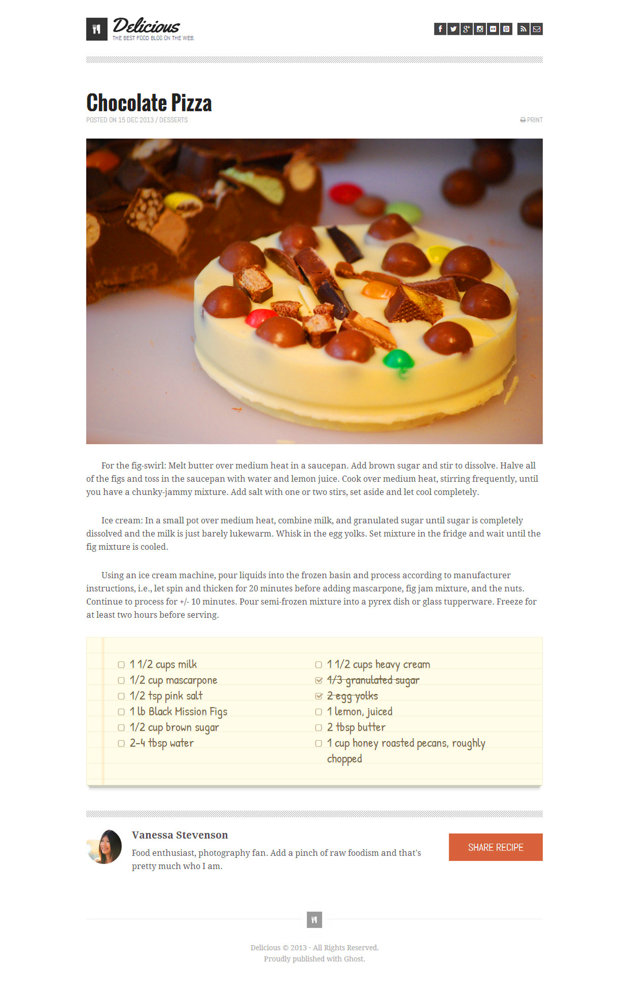

# Chocolate Pizza
Students in DeltaV's Code 201 are asked to complete a time-boxed design comp assignment, called "Chocolate Pizza".

## Goals of the assignment are to:

- Get the HTML/CSS to match the mockup as closely as possible.
- Content should be centered in the window.
- Create and clone a repository.
- In Git, checkout a new branch.
- Make regular Git commits with appropriately descriptive commit messages while you are working.
- Push the final code to GitHub and merge the branch into master.
- Deploy the page [on GitHub Pages](https://mlhaus.github.io/cr-301d5/class-00/lab-c/lab/ "on GitHub Pages").

## Extensions of the assignment include:

- Making the layout responsive.
- Use grids and flex positioning
